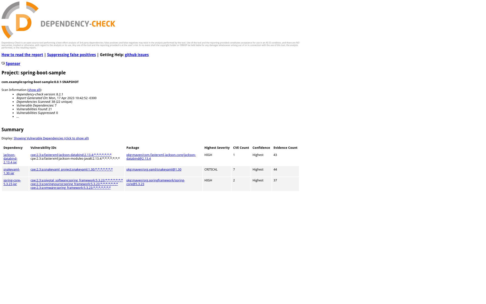

# Dependency Check - Exemplo de Uso

Dependency check é um software utilizado para detectar vulnerabilidades públicas nas dependências de um projeto. 

Para maiores informações, consultar:   
https://owasp.org/www-project-dependency-check/

## Objetivo

Esta aplicação foi construída para exemplicar o uso do dependency check. Algumas bibliotecas foram colocadas propositalmente com uma versão mais antiga, para ilustar o uso da ferramenta.

## Utilizando o Dependency Check
O Dependency Check pode ser acionado via maven, bastando adicionar a dependência no pom

~~~
...
	<build>
		<plugins>
			<plugin>
				<groupId>org.springframework.boot</groupId>
				<artifactId>spring-boot-maven-plugin</artifactId>
			</plugin>
			<plugin>
				<groupId>org.owasp</groupId>
				<artifactId>dependency-check-maven</artifactId>
				<executions>
					<execution>
						<goals>
							<goal>check</goal>
						</goals>
					</execution>
				</executions>
			  </plugin>
		</plugins>
	</build>
...
~~~

### Executando

Comando:
~~~
mvn install
~~~

Na saída, teremos algo como:   
~~~
[INFO] --- dependency-check-maven:8.2.1:check (default) @ spring-boot-sample ---
[INFO] Checking for updates
[INFO] Download Started for NVD CVE - Modified
[INFO] Download Complete for NVD CVE - Modified  (1176 ms)
[INFO] Processing Started for NVD CVE - Modified
[INFO] Processing Complete for NVD CVE - Modified  (1221 ms)
[INFO] Begin database maintenance
...
[INFO] Analysis Started
[INFO] Finished Archive Analyzer (0 seconds)
[INFO] Finished File Name Analyzer (0 seconds)
[INFO] Finished Jar Analyzer (0 seconds)
[INFO] Finished Dependency Merging Analyzer (0 seconds)
[INFO] Finished Version Filter Analyzer (0 seconds)
[INFO] Finished Hint Analyzer (0 seconds)
[INFO] Created CPE Index (1 seconds)
[INFO] Finished CPE Analyzer (1 seconds)
[INFO] Finished False Positive Analyzer (0 seconds)
[INFO] Finished NVD CVE Analyzer (0 seconds)
[INFO] Finished Sonatype OSS Index Analyzer (3 seconds)
[INFO] Finished Vulnerability Suppression Analyzer (0 seconds)
[INFO] Finished Known Exploited Vulnerability Analyzer (0 seconds)
[INFO] Finished Dependency Bundling Analyzer (0 seconds)
[INFO] Finished Unused Suppression Rule Analyzer (0 seconds)
[INFO] Analysis Complete (5 seconds)
...
~~~

### Resultados
O resultado poderá ser visto no próprio console, como pode ser visto abaixo:

~~~
One or more dependencies were identified with known vulnerabilities in spring-boot-sample:

jackson-databind-2.13.4.jar (pkg:maven/com.fasterxml.jackson.core/jackson-databind@2.13.4, cpe:2.3:a:fasterxml:jackson-databind:2.13.4:*:*:*:*:*:*:*, cpe:2.3:a:fasterxml:jackson-modules-java8:2.13.4:*:*:*:*:*:*:*) : CVE-2022-42003
snakeyaml-1.30.jar (pkg:maven/org.yaml/snakeyaml@1.30, cpe:2.3:a:snakeyaml_project:snakeyaml:1.30:*:*:*:*:*:*:*) : CVE-2022-1471, CVE-2022-25857, CVE-2022-38749, CVE-2022-38751, CVE-2022-38752, CVE-2022-41854, CVE-2022-38750
spring-core-5.3.23.jar (pkg:maven/org.springframework/spring-core@5.3.23, cpe:2.3:a:pivotal_software:spring_framework:5.3.23:*:*:*:*:*:*:*, cpe:2.3:a:springsource:spring_framework:5.3.23:*:*:*:*:*:*:*, cpe:2.3:a:vmware:spring_framework:5.3.23:*:*:*:*:*:*:*) : CVE-2023-20860, CVE-2023-20861
spring-expression-5.3.23.jar (pkg:maven/org.springframework/spring-expression@5.3.23, cpe:2.3:a:pivotal_software:spring_framework:5.3.23:*:*:*:*:*:*:*, cpe:2.3:a:springsource:spring_framework:5.3.23:*:*:*:*:*:*:*, cpe:2.3:a:vmware:spring_framework:5.3.23:*:*:*:*:*:*:*) : CVE-2023-20860, CVE-2023-20863, CVE-2023-20861
spring-web-5.3.23.jar (pkg:maven/org.springframework/spring-web@5.3.23, cpe:2.3:a:pivotal_software:spring_framework:5.3.23:*:*:*:*:*:*:*, cpe:2.3:a:springsource:spring_framework:5.3.23:*:*:*:*:*:*:*, cpe:2.3:a:vmware:spring_framework:5.3.23:*:*:*:*:*:*:*, cpe:2.3:a:web_project:web:5.3.23:*:*:*:*:*:*:*) : CVE-2016-1000027, CVE-2023-20860, CVE-2023-20861
spring-webmvc-5.3.23.jar (pkg:maven/org.springframework/spring-webmvc@5.3.23, cpe:2.3:a:pivotal_software:spring_framework:5.3.23:*:*:*:*:*:*:*, cpe:2.3:a:springsource:spring_framework:5.3.23:*:*:*:*:*:*:*, cpe:2.3:a:vmware:spring_framework:5.3.23:*:*:*:*:*:*:*, cpe:2.3:a:web_project:web:5.3.23:*:*:*:*:*:*:*) : CVE-2023-20860, CVE-2023-20861
tomcat-embed-core-9.0.65.jar (pkg:maven/org.apache.tomcat.embed/tomcat-embed-core@9.0.65, cpe:2.3:a:apache:tomcat:9.0.65:*:*:*:*:*:*:*, cpe:2.3:a:apache_tomcat:apache_tomcat:9.0.65:*:*:*:*:*:*:*) : CVE-2022-42252, CVE-2022-45143, CVE-2023-28708
~~~

Ou pode-se visualizar na pasta abaixo um report em html.

~~~
target/dependency-check-report.html
~~~

